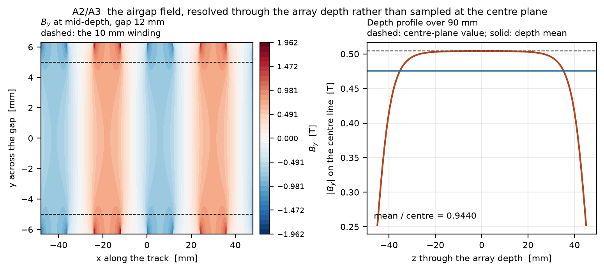

> ## What is generated here, and what is not
>
> **Generated** from [aaaaaaaaaaaavm/VOLLEY](https://github.com/aaaaaaaaaaaavm/VOLLEY) at commit
> `34ebdcd` by `tools/export_companion.py`: the analysis scripts and their results, the
> validation run sheets, the figures, and the reference records. Any edit to those is
> destroyed on the next export. **Fix them in VOLLEY and this repository picks the fix up.**
>
> **Authored here, and never overwritten:** the manuscript, its class file, the built PDF, the CV and the submission archive, all under `paper/`. VOLLEY is an engineering
> record and holds no manuscript source.
>
> Where a generated file disagrees with VOLLEY, VOLLEY is right and this copy is stale.
>
> **This repository may be improved until the work is published, and freezes at that
> moment.** What enters it has to be stable, effective and reliable against the problem
> statement -- not merely newer.

<!-- PROGRAMME-HEADER-START -->
| Repository | Role | You are here |
|---|---|---|
| [VOLLEY](https://github.com/aaaaaaaaaaaavm/VOLLEY) | Main: the authoritative engineering record. Improved continuously |  |
| **[VOLLEY-paper](https://github.com/aaaaaaaaaaaavm/VOLLEY-paper)** | The concept at its most reliable, as a conference contribution. **Frozen when published** | ← |
| [VOLLEY-thesis](https://github.com/aaaaaaaaaaaavm/VOLLEY-thesis) | The same concept as a full submission. **Frozen when presented** |  |
| [VOLLEY-lab](https://github.com/aaaaaaaaaaaavm/VOLLEY-lab) | The vault: ideas that never became a complete thing, and why each stopped |  |
<!-- PROGRAMME-HEADER-END -->

---

# VOLLEY: the conference paper

<p align="center">
  
</p>

<p align="center">
  
  
</p>

<p align="center"><sub><b>Left:</b> the airgap field, resolved through the array's 90 mm depth rather than sampled at the centre plane &mdash; the assumption that cost K<sub>t</sub> <b>4.42&nbsp;%</b>. <b>Right:</b> the converged OpenFOAM solution around the sled, <b>581&nbsp;779 cells</b>; the pressure term is solved, <b>the viscous term is bounded rather than solved</b>.</sub></p>

**The manuscript, and everything needed to check it.**

Rideshare CubeSats inherit the orbit of whoever paid for the launch. This paper describes a
deployer that gives each of twelve satellites an orbit chosen for it, without modifying any of
them — and reports, in the same voice, the three thresholds the design currently fails.

**[Read the paper](paper/VOLLEY_IEEE_Conference.pdf)** (17 pages)

Every number in it comes from a script in this repository, and every analysis behind it declared
what would count as failure **before** it ran. Nothing has been built, fired or measured.

## Reproduce it in one command

```bash
pip install -r requirements.txt
cd analysis && python3 verify_field.py && python3 mass_properties.py \
  && python3 motor_model.py && python3 sizing.py && python3 payload_family.py \
  && python3 astro.py && python3 comparators.py && python3 cost.py
```

Roughly two minutes, and the order matters: everything downstream reads the rated shot from
`motor_results.json` rather than restating it. Results land in `analysis/results/*.json`.

This has been checked from a clean clone rather than assumed: run that way, `motor_results.json`
returns `shot.v_exit = 16.029`, which is the figure the paper's abstract quotes.

## What reproduces, and how well

| Quantity | Value | Cross-checked against |
|---|---|---|
| Thrust constant, depth-resolved | 10.54 N per kA/m | Nothing independent. The FEM check below is of the centre-plane value it derives from |
| Thrust constant, centre-plane | 11.03 N per kA/m | A meshed 2-D magnetostatic FEM, agreeing to 0.03 % |
| Airgap field | 0.694 T midgap peak | magpylib, agreeing to three digits |
| Orbital decay | x1.60 lifetime | Cowell RK4, agreeing to 99.4 % |
| Exit velocity | 16.029 m/s at 10.07 g | Single-sourced |
| Dispersion | 0.0274 m/s, 3 sigma | Single-sourced, and resting on assumed sensor noise |

Only two rows carry an independent check. `PROVENANCE.md` says which of these carry weight.

## Figures

`python3 paper/make_figures.py` regenerates all of them. It imports the analysis rather than
reimplementing it, so a figure cannot quietly disagree with the number it plots.

## Before citing

**Read [`PROVENANCE.md`](PROVENANCE.md).** This is a design study at TRL 2-3. Nothing has been
built, fired or measured, and the paper says so.

[`PRIOR_ART.md`](PRIOR_ART.md) records the published work nearest to this one, including two
claims the paper had to retract after reading it. [`LITERATURE.md`](LITERATURE.md) maps the wider
field.


## The manuscript describes Gen5, and the design target has moved

**This is deliberate and worth stating plainly.** Everything reproduced here is **Gen5** — the
measured baseline, and the record of what a self-contained deployer costs. On 2026-08-14 five
analyses in the main repository replaced the design target: **Gen6 is the payload accelerated
directly, by cold gas, along a rail a spent upper stage provides** (ADR-032). No mover, no
pulse-power chain, no brake, no return stroke.

**Nothing in Gen6 is measured.** Its cradle mechanism does not exist, no launch provider has agreed
to lend a stage, and the seal that owns **98.7 %** of its dispersion has never been on a bench —
which is exactly why the manuscript still carries Gen5. A paper reports what has been analysed to a
declared standard, not what looks best this week.

*Its fluid system is no longer unsized: A56 sized the store at 3.4573 L and 3.1216 kg, ADR-035 chose
the tube material, and A61 specified the seal at 17.8 N. **ADR-036 then suspended the trim stage
rather than building it**, because a seal meeting its own thermal requirement makes the stage
unnecessary — and that decision, like the rest of Gen6, rests on a friction nobody has measured.*

**The main repository carries both**, and the failures at the same standard as the results.

## What is deliberately absent

The engineering record. Decision log, defect ledger, CAD generations, roadmap and change history
live in the flagship. This package exists so the paper can be checked, not so it can stand in for
the repository it came from.
