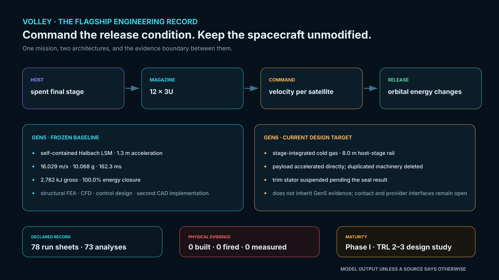

> ## What is synchronized here, and what is not
>
> **Synchronized** from [aaaaaaaaaaaavm/VOLLEY](https://github.com/aaaaaaaaaaaavm/VOLLEY) at commit
> `68c26ae`: the analysis scripts and their results, the validation run sheets, the figures,
> and the reference records. Any edit to those is replaced by the next companion export.
> **Fix them in VOLLEY and this repository picks the fix up.**
>
> **Authored here, and never overwritten:** the manuscript, its class file, the built PDF, the CV and the submission archive, all under `paper/`. VOLLEY is an engineering
> record and holds no manuscript source.
>
> Where a synchronized file disagrees with VOLLEY, VOLLEY is right and this copy is stale.
>
> **This repository may be improved until the work is published, and freezes at that
> moment.** What enters it has to be stable, effective and reliable against the problem
> statement -- not merely newer.

Live programme studies at this export: [sequential campaign allocation](https://github.com/aaaaaaaaaaaavm/VOLLEY/blob/68c26ae/docs/CAMPAIGN_ALLOCATION.md)
and [architecture decision gates](https://github.com/aaaaaaaaaaaavm/VOLLEY/blob/68c26ae/docs/PROGRAMME_EXECUTION.md).
[Terminal-state timing](https://github.com/aaaaaaaaaaaavm/VOLLEY/blob/68c26ae/docs/TERMINAL_TIMING.md)
extends the single-payload benchmark.
[Two-payload manifest timing](https://github.com/aaaaaaaaaaaavm/VOLLEY/blob/68c26ae/docs/MANIFEST_TIMING.md)
adds shared-host coupling while P113/E5 remain open.
[Clean-sheet Gen6 reference](https://github.com/aaaaaaaaaaaavm/VOLLEY/blob/68c26ae/docs/GEN6_REFERENCE_ARCHITECTURE.md)
carries that bounded mission result into a compact reference cell while P92 remains open. These studies extend the engineering record;
the authored manuscript remains Gen5.

<!-- PROGRAMME-HEADER-START -->
| Repository | Role | You are here |
|---|---|---|
| [VOLLEY](https://github.com/aaaaaaaaaaaavm/VOLLEY) | Main: the authoritative engineering record. Improved continuously |  |
| **[VOLLEY-paper](https://github.com/aaaaaaaaaaaavm/VOLLEY-paper)** | The concept at its most reliable, as an IEEE-formatted manuscript. **Frozen when published** | ← |
| [VOLLEY-thesis](https://github.com/aaaaaaaaaaaavm/VOLLEY-thesis) | The same concept as a full submission. **Frozen when presented** |  |
| [VOLLEY-lab](https://github.com/aaaaaaaaaaaavm/VOLLEY-lab) | The vault: ideas that never became a complete thing, and why each stopped |  |
<!-- PROGRAMME-HEADER-END -->

---

# VOLLEY: the manuscript

An IEEE-formatted technical manuscript, and everything needed to check it.

<p align="center"></p>

<p align="center"><sub>The manuscript reports Gen5. The engineering programme has moved beyond
that frozen machine: the stage-integrated gas-guide Gen6 is now a comparator. The clean-sheet reference is an
independent retained cell with stored mechanical release energy; P92 remains open. Newer directions do not inherit Gen5 evidence.</sub></p>

<p align="center">
  
  
  
</p>

<p align="center"><sub>Field assumption → modelled shot → architecture verdict. The manuscript's
visual spine is generated from the same analysis files as its tables.</sub></p>

Rideshare CubeSats inherit the orbit of whoever paid for the launch. This paper describes a
deployer that gives each of twelve satellites an orbit chosen for it, without modifying any of
them, and reports, in the same voice, the three thresholds the design currently fails.

## What the manuscript's machine is for

VOLLEY is a last-mile orbital delivery programme. After the primary spacecraft separates, the
launch vehicle's final stage can, where host capability and mission rules permit, continue as a
temporary controlled orbital delivery platform. The host performs the coarse orbital
repositioning; VOLLEY produces the fine, individually commanded release condition for each
secondary satellite.

The machine reported here is Gen5: the *self-contained* electromagnetic implementation of that
mission, its own track, drive, sled, energy store, brake and magazine, operating aboard the
platform. Host repositioning is treated parametrically throughout, because no launch provider
has supplied stage propulsion or control-authority data.

> The programme later investigated a stage-integrated cold-gas guide as Gen6: the stage's own
> structure and roughly 8 m of length became part of the machine. Contact/release and trim work
> exposed unresolved limits, and the flagship has since reopened mechanism selection. The
> manuscript has not moved with those investigations, deliberately. Gen5 remains the fully
> analysed manuscript configuration. *A paper does not follow a design target; it follows evidence.*

[Read the paper](paper/VOLLEY_IEEE_Conference.pdf), 18 pages, current build.
Print-ready copies: [A4](print/Adityavardhan_Mishra_VOLLEY_IEEE_2026_A4_Print.pdf) ·
[US Letter](print/Adityavardhan_Mishra_VOLLEY_IEEE_2026_Letter.pdf). Both come from one source
and are content-identical; only the page geometry differs.

> It is IEEE-*formatted*, using the IEEEtran class. It is not claimed to be submission-compliant
> for any venue, page and abstract limits are set by the conference or journal, and no venue
> has been selected and nothing has been submitted.

Every number in it comes from a script in this repository, and every analysis behind it declared
what would count as failure before it ran. Nothing has been built, fired or measured.

## Reproduce it in one command

```bash
pip install -r requirements.txt
cd analysis && python3 verify_field.py && python3 mass_properties.py \
  && python3 motor_model.py && python3 sizing.py && python3 payload_family.py \
  && python3 astro.py && python3 comparators.py && python3 cost.py
```

Roughly two minutes, and the order matters: everything downstream reads the rated shot from
`motor_results.json` rather than restating it. Results land in `analysis/results/*.json`.

This has been checked from a clean clone rather than assumed: run that way, `motor_results.json`
returns `shot.v_exit = 16.029`, which is the figure the paper's abstract quotes.

## What reproduces, and how well

| Quantity | Value | Cross-checked against |
|---|---|---|
| Thrust constant, depth-resolved | 10.54 N per kA/m | Nothing independent. The FEM check below is of the centre-plane value it derives from |
| Thrust constant, centre-plane | 11.03 N per kA/m | A meshed 2-D magnetostatic FEM, agreeing to 0.03 % |
| Airgap field | 0.694 T midgap peak | magpylib, agreeing to three digits |
| Orbital decay | x1.60 lifetime | Cowell RK4, agreeing to 99.4 % |
| Exit velocity | 16.029 m/s at 10.07 g | Single-sourced |
| Dispersion | 0.0274 m/s, 3 sigma | Single-sourced, and resting on assumed sensor noise |

Only two rows carry an independent check. `PROVENANCE.md` says which of these carry weight.

## Figures

`python3 paper/make_figures.py` regenerates all of them. It imports the analysis rather than
reimplementing it, so a figure cannot quietly disagree with the number it plots.

## Before citing

Read [`PROVENANCE.md`](PROVENANCE.md). This is a design study at TRL 2-3. Nothing has been
built, fired or measured, and the paper says so.

[`PRIOR_ART.md`](PRIOR_ART.md) records the published work nearest to this one, including two
claims the paper had to retract after reading it. [`LITERATURE.md`](LITERATURE.md) maps the wider
field.


## The manuscript describes Gen5, and the programme has moved beyond it

This is deliberate and worth stating plainly. Everything reproduced here is Gen5, the analysed
baseline -- a frozen computational one, with no hardware behind it -- and the record of what a
self-contained deployer costs. On 2026-08-14 the main repository introduced the stage-integrated
cold-gas guide as Gen6 (ADR-032). Later contact/release and trim work exposed limits in that
architecture, and the flagship has since reopened mechanism selection.

Nothing in the existing gas-guide Gen6 is measured, and no launch provider has agreed to lend a
stage. That is exactly why the manuscript still carries Gen5. A paper reports what has been
analysed to a declared standard, not whichever architecture is currently being investigated.

The main repository carries Gen5, the existing gas-guide comparator and the clean-sheet selection
work, with failures kept at the same standard as results.

## What is deliberately absent

The engineering record. Decision log, defect ledger, CAD generations, roadmap and change history
live in the flagship. This package exists so the paper can be checked, not so it can stand in for
the repository it came from.
