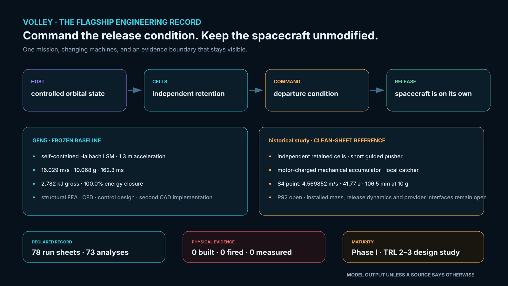
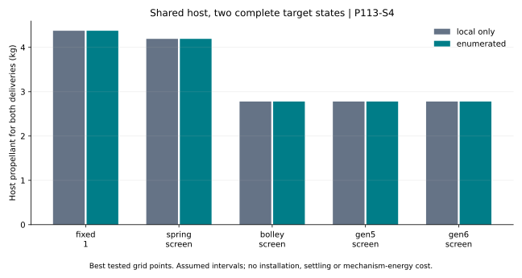

# VOLLEY Gen5 — paper and reproducibility package

### A system-level computational design study of a programmable electromagnetic CubeSat deployer

This repository is the **standalone companion** to an [IEEE-formatted, 16-page manuscript](paper/VOLLEY_IEEE_Conference.pdf). It includes the manuscript source, cited local figures, CAD, analysis code and outputs, validation records, assumptions and known defects. A reader can evaluate the paper from this repository alone.

> **Publication state, October 2026:** The paper is **not submitted or peer reviewed**. No IEEE venue has been selected, so venue-specific page, abstract, reference and copyright requirements have not been checked. Gen5 is a fixed computational baseline; Gen6 is future scaling research toward a 1 km/s-class objective. No VOLLEY hardware has been built, fired, measured, qualified or flown.

<p align="center"></p>

*Architecture figure from this repository. Host operations and payload interface are conceptual and provider dependent.*

**Start here:** [Paper PDF](paper/VOLLEY_IEEE_Conference.pdf) · [LaTeX source](paper/paper.tex) · [Claim audit](CLAIM_CORRECTIONS_2026-10-09.md) · [Computational review PDF](reports/GEN5_COMPUTATIONAL_REVIEW.pdf) · [FreeCAD/CAD review PDF](cad/GEN5_CAD_REVIEW.pdf) · [Artifact checksums](ARTIFACT_MANIFEST.sha256) · [Build notes](paper/README.md) · [Market and spacecraft fit](MARKET_AND_CUSTOMER_FIT.md) · [Claim provenance](PROVENANCE.md) · [Baseline](BASELINE.md) · [Validation register](validation/README.md)

## What the paper actually establishes

Gen5 models a magazine-fed, reusable-sled electromagnetic deployer for twelve unmodified 3U CubeSats on a host platform. The release station is 1.5 m from the breech on 1.8 m structural longerons; the powered stroke is 1.3 m. The design includes a double-sided Halbach linear motor, pulse-energy store and eddy-current sled arrest. A qualified host, complete release mechanism and flight interface have not been selected.

| Reported quantity | Gen5 result | How to read it |
|:--|--:|:--|
| Rated 3U exit speed | **16.029 m/s** | Coupled model output, not measured release speed or proven command envelope |
| Modeled acceleration | **10.07 g** | Payload-specific structural compatibility unproven |
| Gross shot energy | **2.78 kJ** | Circuit and dynamics model at the rated point |
| Dry / loaded mass | **126.6 / 174.6 kg** | Modeled rollup with a historical Gen3 sled solid-volume input and assumed components; installed host system not closed |
| Exit-speed dispersion | **0.0274 m/s (3σ)** | Closed-loop simulation with assumed sensor and uncertainty terms |
| 3U deployer mass per satellite | **10.547 kg** | Fails the stated roughly 2 kg/satellite economic criterion |
| Single-shot orbit case | **28.8 km** semi-major-axis rise; **1.60×** modeled lifetime | Stated 450 km, mean-activity case; lifetime result has not been independently rerun at the current rated point |
| Side-fed CAD reference fit | **11 mm width shortfall** | FreeCAD and CadQuery STEP intersection also finds 32,915 mm³ clash per cassette; feeder redesign needed |

See [baseline field names](BASELINE.md), [method limits](PROVENANCE.md), [decision gates and open problems](EVIDENCE_LIMITS.md). The approximately 6 kg/3U canister comparison is a separate incumbent-hardware parity test; it also fails (10.547/6 ≈ 1.76). These are two different decision boundaries.

<p align="center"> </p>

*Generated from this repository's [mass](analysis/results/mass_properties.json) and [shot](analysis/results/motor_results.json) outputs by the local [plot script](tools/plot_gen5_decision.py). Neither is a measurement. The [P117 algebra audit](validation/P117_rated_energy_mass_audit.md) finds 124.488 J of gross draw unitemized; the grey section is not a closed loss audit.*

<p align="center"> </p>

*The separate Cartesian calculation recovers **28.800775 km** of immediate axis rise; it does not verify lifetime. The side-fed [native FreeCAD project](cad/native/Gen5_Review.FCStd) and [assembly STEP](cad/step/gen5/VOLLEY_Review_Assembly_FreeCAD_Gen5.step) retain a measured track/cassette clash. [Orbit method](validation/P115_rated_orbit_cartesian.md) · [CAD report](cad/GEN5_CAD_REVIEW.pdf).*

<p align="center">  </p>

*Field → shot → mass floor. The numerical field cross-check applies to selected quantities, not to the entire machine. The mass-ledger result is a negative finding, not a design endorsement.*

## Evidence levels

| Level | Present evidence | Limit |
|:--|:--|:--|
| Model calculation | Shot, orbit, control, thermal, mass and CAD outputs in [analysis](analysis/) and [cad](cad/) | Depends on assumed inputs and geometry |
| Independent numerical cross-check | Selected field, circuit and orbital calculations in [validation](validation/) | Checks defined model aspects and cases only |
| External literature or products | [Prior art](PRIOR_ART.md), [literature](LITERATURE.md), bibliography in the manuscript | Supports comparison and assumptions; does not validate Gen5 hardware |
| Physical qualification | **None** | Release repeatability, loads, feeder, recoil, environmental and host acceptance remain open |



*The timing figure is a sampled mission study. Its 4.57 m/s best point is not an achieved launcher setting, a maximum speed or a full twelve-payload mission result.*

## Reproduce the published model point

```bash
python3 -m pip install -r requirements.txt
cd analysis
python3 verify_field.py
python3 mass_properties.py
python3 motor_model.py
python3 sizing.py
python3 payload_family.py
python3 astro.py
python3 comparators.py
python3 cost.py
```

Outputs are written under [analysis/results](analysis/results/). Run in the listed order because downstream analyses read the rated shot from `motor_results.json`. The cited artifact is the checked-in result set; dependency and solver availability may affect a new run. [Build both paper page sizes](paper/README.md) and [regenerate figures](paper/make_figures.py) from local sources.

## Package map

| Path | Purpose |
|:--|:--|
| [paper/](paper/) | Authored LaTeX, figures and current Letter PDF |
| [print/](print/) | Current A4 and Letter handover PDFs |
| [analysis/](analysis/) | Executable models and captured JSON results |
| [validation/](validation/) | Predeclared run sheets, cross-checks and failures |
| [cad/](cad/) | Gen5 source parts, eight FreeCAD-exported STEP parts, native FCStd assembly, failure report and rendered views |
| [reports/](reports/) | Local four-page computational evidence review and its source |
| [BASELINE.md](BASELINE.md), [PROVENANCE.md](PROVENANCE.md), [EVIDENCE_LIMITS.md](EVIDENCE_LIMITS.md) | Claim values, evidence classes and unresolved decisions |

The analysis and reference records began as a dated engineering snapshot and now include local P115/P116 checks and FreeCAD exports. This copy is the evidence package for the manuscript; later changes elsewhere do not silently change its claims. The manuscript and PDFs are authored here. Any future update requires rerunning the local checks and recording the changed sources. [VOLLEY engineering](https://github.com/aaaaaaaaaaaavm/VOLLEY), [college thesis](https://github.com/aaaaaaaaaaaavm/VOLLEY-thesis) and [research vault](https://github.com/aaaaaaaaaaaavm/VOLLEY-lab) provide optional programme context.
