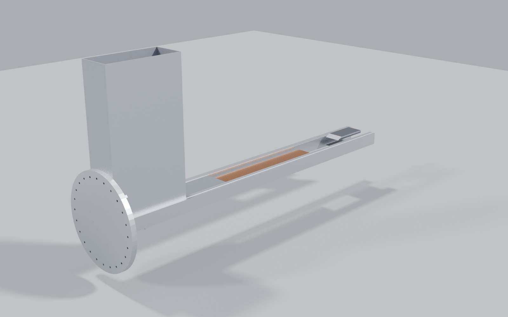

# Gen5 geometry included with the paper

The [eight STEP parts](step/gen5/) and [rendered views](renders/gen5/) are copied Gen5 design artifacts. Together with the [system drawing](../paper/figures/D02_layout.png), they let a reader inspect the configuration described in the manuscript without opening a different repository.

*Computer rendering of the modeled Gen5 geometry; no hardware has been made.*

| Part | STEP file |
|:--|:--|
| Track | [VOLLEY_Track_Gen5.step](step/gen5/VOLLEY_Track_Gen5.step) |
| Stator | [VOLLEY_Stator_Gen5.step](step/gen5/VOLLEY_Stator_Gen5.step) |
| Sled | [VOLLEY_Sled_Gen5.step](step/gen5/VOLLEY_Sled_Gen5.step) |
| Brake | [VOLLEY_Brake_Gen5.step](step/gen5/VOLLEY_Brake_Gen5.step) |
| Enclosure | [VOLLEY_Enclosure_Gen5.step](step/gen5/VOLLEY_Enclosure_Gen5.step) |
| Magazine cassette | [VOLLEY_Magazine_Cassette_Gen5.step](step/gen5/VOLLEY_Magazine_Cassette_Gen5.step) |
| Payload placeholder | [VOLLEY_Payload_3U_Gen5.step](step/gen5/VOLLEY_Payload_3U_Gen5.step) |
| Host-interface placeholder | [VOLLEY_Interface_ESPA_Gen5.step](step/gen5/VOLLEY_Interface_ESPA_Gen5.step) |

The model establishes an analyzable arrangement and supports the reported mass calculation. The parts are **not** controlled manufacturing drawings, a tolerance analysis or an approved host ICD. The host interface remains a placeholder; no launch provider has accepted this assembly. See [paper claim limits](../EVIDENCE_LIMITS.md) and [mass result](../analysis/results/mass_properties.json).
